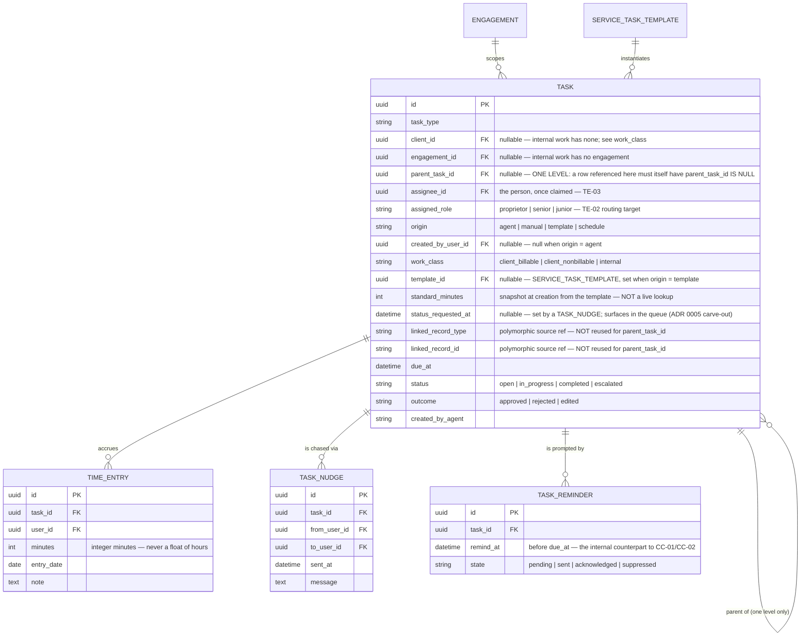
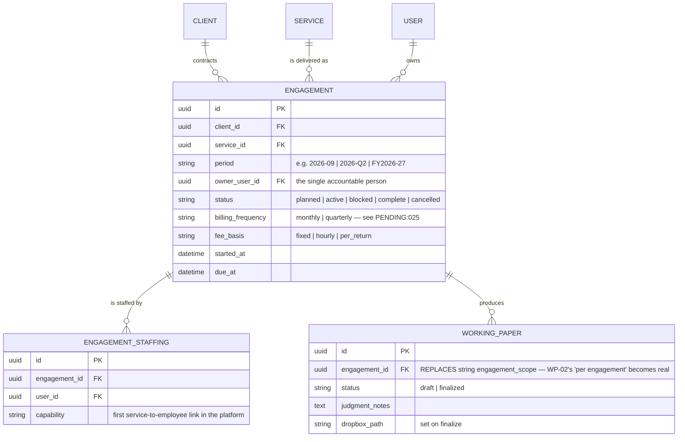
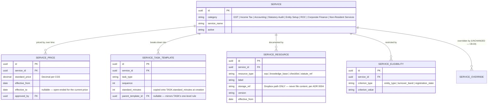

# ADR 0015 — Engagement and Task Model Redesign

**Status:** Accepted 2026-09-21
**Date:** 2026-09-20
**Relates to:** ADR 0004 (Platform as a Thin Layer), ADR 0005 (Task Engine as the Shared Backbone), ADR 0013 (HRMS Integration — Frappe HR, *Proposed*)
**Triggers supersession of:** ADR 0013 (HRMS Integration — Frappe HR) — see Decision 7; its integration target no longer exists. Superseded by ADR 0016
**Reverses, in part:** the PRD §6 deferral of "Knowledge Base/Query Assistant", narrowly — see Decision 6
**Out of scope:** specifying native attendance capture, geofencing and payroll export (the superseding ADR's job — Decision 7); sprint resequencing (see "Not decided here")

## Context

### Provenance — this ADR is different from the fourteen before it

**ADR 0015 originates from customer-review feedback, not from a spike finding or an
internal consistency gap.** This is worth stating plainly, because every prior ADR in
this folder has a technical or discovery provenance: 0001–0010 came out of the
Internal Development Readiness discovery work, 0011 and its two amendments came out of
the P0-06 Zoho spike's findings, 0012 came out of cost metering, 0013 came out of an
identified capability gap in the PM module, and 0014 came out of a contradiction
between three existing ADRs.

0015 has none of those. It exists because a customer review produced eleven feedback
items that shift the platform's centre of gravity toward **practice time measurement
and utilisation** — a concern the PRD addresses in exactly one requirement (PM-05) and
the schema addresses nowhere at all.

Future sessions should weigh this accordingly. The decisions below are not derived from
a sandbox observation that can be re-run, nor from reconciling two documents that can be
re-read. They rest on a reading of what the practice said it wants, which is a weaker
and more revisable foundation than "Tally's `Import Data` response does not reliably
signal failure." Where that weakness bites hardest is Decision 5, which carries an
explicit falsification condition for that reason.

### What the gap report established

A read-only audit against actual repo state — not against the docs' self-description —
found that of the eleven feedback items, one is fully covered, three are partial, and
seven are absent. A concept grep across `services/api/app`, `services/api/tests`,
`services/web/src` and both ER diagrams returned four hits, all of them the strings
`engagement_scope` and `BILLABLE_EVENT` in the compliance-billing diagram. There is no
code near this feature set.

Three structural absences drive this ADR:

**1. There is no `ENGAGEMENT` entity.** Neither `.mermaid` file declares one. The
concept exists three times as free text: the relationship label
`CLIENT ||--o{ WORKING_PAPER : "has, per engagement"`, the attribute
`string engagement_scope` on `WORKING_PAPER`, and WP-02's "Generate a draft working
paper per engagement". An engagement is currently a string on one entity.

**2. CB-01's "services subscribed" has never had a backing field.** CB-01 specifies a
client master profile carrying "services subscribed (GST / IT / Statutory Audit / ROC /
Advisory)". No such field or join entity exists in either ER diagram, and
`services/api/app/models/client.py` carries `legal_name, entity_type, gstin,
primary_contact, billing_cycle, books_system, status, created_at` and nothing else.
`SERVICE_CATALOG` and `SERVICE_OVERRIDE` model service *pricing*; nothing models which
services a client actually buys.

**3. There is no `TIME_ENTRY` anywhere, and PM-05's premise is known-false.** PM-05
(time-per-task tracking) sits in Sprint 11 with no backing entity and no endpoint in API
spec §15. Worse, the sprint plan's own changelog (v0.2.2) and `context.md` record that
P0-01 — the task-sheet baseline measurement — was found **not executable**, because "the
practice is not tracking timesheets at all, so the item's premise is false rather than
the data merely being unavailable." Both the sprint plan and the PRD describe PM-05 as
*extending the practice's existing task-sheet habit*; the sprint plan flags this as
undercut and leaves it unrescoped: "PM-05 is therefore likely introducing time tracking
rather than extending it, which is a different design and adoption problem."

So the single requirement that would have carried the customer's new centre of gravity
has no schema, no baseline, and a false description.

### Why now, and why this is cheap today

**No model file exists for any compliance-billing entity.** `INVOICE`,
`SERVICE_CATALOG`, `SERVICE_OVERRIDE`, `BILLABLE_EVENT`, `WORKING_PAPER`,
`RECONCILIATION`, `VALIDATION_CHECK`, `TDS_RECORD`, `BANK_ACCOUNT`, `BANK_TXN`,
`COMMUNICATION`, `NOTICE` and `GSP_CREDENTIAL` are diagram-only.
`services/api/app/models/` contains exactly the core-diagram entities (`audit_event,
books_connection, client, document, email_sender_map, routing_rule, task, user,
vendor_mapping, voucher`), and `app/agents/` is empty but for `__init__.py`. Sprint 1–2
has not started on any entity this ADR touches.

This is the same timing argument the index already records for ADR 0011's two
amendments — *free now, expensive after the code is written*. Restructuring
`SERVICE_CATALOG` today costs a diagram edit. Restructuring it after Sprint 10 costs a
migration, a data backfill, and invoice-reproducibility risk.

`TASK` is the one exception and is treated as such: it *is* built
(`services/api/app/models/task.py`, `app/task_engine/service.py`,
`app/routers/tasks.py`), so Decision 3's additions are genuinely a Sprint-1-2-or-later
migration, not a free diagram edit.

## Decision

### 1. Introduce `ENGAGEMENT` and `ENGAGEMENT_STAFFING`

`ENGAGEMENT` carries `client_id`, `service_id`, `period`, `owner_user_id`, `status`,
`billing_frequency`, `fee_basis`, `started_at`, `due_at`.
`ENGAGEMENT_STAFFING` carries `engagement_id`, `user_id`, `capability`.

An engagement is one instance of one service delivered to one client for one period —
"Coastal Services, GSTR-3B, 2026-09". It is the unit that work attaches to, that time
accrues against, and that gets billed.

**Reasoning.** This is the join the platform has been missing. Three separate recorded
gaps resolve to the same absent entity:

- **`WORKING_PAPER.engagement_scope` gets a real FK.** WP-02 already says "per
  engagement"; the schema said "here is a string". Replacing `engagement_scope` with
  `engagement_id` makes the relationship label
  `CLIENT ||--o{ WORKING_PAPER : "has, per engagement"` structurally true rather than
  aspirational, and routes the working paper through the engagement to the client rather
  than duplicating `client_id` on both.
- **CB-01's "services subscribed" gets its first backing field.** A client's subscribed
  services become the distinct `service_id`s across their active engagements — derived,
  not a second denormalised list to keep in sync with reality.
- **`ENGAGEMENT_STAFFING` is the first service-to-employee link in the platform.**
  `USER` currently carries `name, email, role, status`; there is no skill,
  specialisation, or service assignment anywhere. `capability` (*inference: something
  like `preparer | reviewer | signer`, not settled here*) is what lets PM-03's capacity
  indicator answer "who can take this GST engagement" rather than only "who has fewest
  open tasks".

`owner_user_id` is the single accountable person; `ENGAGEMENT_STAFFING` is everyone
else. Both are needed — an engagement with three staff and no owner is how work goes
unclaimed, which is the discipline gap ADR 0005 exists to close.

**Rejected: engagement as a string on `TASK`.** Cheapest, and it is what `WORKING_PAPER`
does today. Rejected because it cannot carry `owner_user_id`, `billing_frequency` or
`fee_basis`, cannot be staffed, and cannot be counted — "how many GST engagements are
open this quarter" becomes a string-matching query. The existing `engagement_scope` field
is itself the evidence that this approach does not grow.

**Rejected: reusing `SERVICE_OVERRIDE` as the subscription list.** A client's
`SERVICE_OVERRIDE` rows do name services, so they nearly work as a subscription list.
Rejected because an override is a *pricing exception* — a client who buys a service at
standard price has no override row, so the list would silently omit every client without
negotiated pricing. Conflating "what they buy" with "what they pay a special rate for" is
a category error that would break CB-01 for the majority case.

**Rejected: `ENGAGEMENT` per client-service, with period as a child.** Considered,
because it avoids a row per client per service per month. Rejected because
`billing_frequency`, `fee_basis` and `owner_user_id` can all legitimately change between
periods, and a parent/child split puts them at the wrong level.

### 2. Split `SERVICE_CATALOG` into five entities

`SERVICE_CATALOG` becomes `SERVICE`, `SERVICE_PRICE`, `SERVICE_TASK_TEMPLATE`,
`SERVICE_RESOURCE` and `SERVICE_ELIGIBILITY`. **`SERVICE_OVERRIDE` is unchanged** and
continues to reference a service, with CB-03's reason/approval semantics intact.

- **`SERVICE`** — identity and category only. What the practice sells.
- **`SERVICE_PRICE`** — versioned and effective-dated. A price is valid `from`/`to`,
  never edited in place.
- **`SERVICE_TASK_TEMPLATE`** — the standard task breakdown for a service, and the
  source of `standard_minutes` in Decision 3.
- **`SERVICE_RESOURCE`** — versioned pointers to SOP and knowledge-base documents. See
  Decision 6.
- **`SERVICE_ELIGIBILITY`** — which entity types / turnover bands / registration states
  a service applies to.

**Reasoning.** `SERVICE_CATALOG` today is `category, service_name, standard_price,
active` — a price list. Five of the eleven feedback items (engagement/service mapping,
task time preset, KB doc per service, per-service SOP, invoice/billing cycles) all want a
service to be a richer thing than a price list row. Five concerns with five different
lifecycles, cardinalities and access rules do not belong in one table: a price changes
quarterly, an SOP changes when the law changes, eligibility changes with statute, and a
task template changes when the practice changes how it works.

**`SERVICE_PRICE` being effective-dated is the load-bearing part.** CB-02 and CB-03
already require that pricing be auditable — CB-03 records "the reason and who approved
it". An invoice raised in March must remain reproducible in September, which requires
knowing the price *as at* the billing period, not the price as at query time.

**Rejected: mutate `standard_price` in place, keep one table.** This is the current
design. Rejected because it makes historical invoices irreproducible: re-rendering a
March invoice after an April price change silently produces different numbers, with no
record that anything changed. For a practice whose output is audit work, a billing system
that cannot reproduce its own history is not defensible. Security Standard §5 already
requires that compliance events be append-only and that "if an audit record needs
correction, that's a new record referencing the original, not a mutation of history" — the
same principle applied to prices gives effective-dating.

**Rejected: JSON blob on `SERVICE` for templates, resources and eligibility.** Tempting
given none of this is built. Rejected because `SERVICE_TASK_TEMPLATE` needs an FK *from*
`TASK.template_id` (Decision 3), and `SERVICE_RESOURCE` needs per-row versioning —
neither of which a blob supports without reimplementing relational integrity in
application code, against CG9's "Pydantic models for every request/response shape" grain.

**Rejected: deferring the split to Sprint 10.** Rejected on the timing argument above. No
model file exists for any of these entities; the split is a diagram edit today and a
migration plus backfill later.

### 3. Extend `TASK`

Add `parent_task_id`, `engagement_id`, `origin` (`agent|manual|template|schedule`),
`created_by_user_id`, `work_class` (`client_billable|client_nonbillable|internal`),
`template_id`, and `standard_minutes`.

**`parent_task_id` is one level only. A child may not itself be a parent.** Stated as an
invariant that is checkable in the database: any row referenced as a `parent_task_id`
must itself have `parent_task_id IS NULL`.

**`standard_minutes` is a snapshot taken at creation**, copied from the
`SERVICE_TASK_TEMPLATE` row identified by `template_id` — not a live lookup. The same
reproducibility argument as `SERVICE_PRICE`: changing a template must not retroactively
alter what past tasks were budgeted at, or every historical variance figure moves.

**`parent_task_id` must NOT reuse `linked_record_type` / `linked_record_id`.**

The existing polymorphic pair looks like it could carry a parent link, and it cannot. The
model's own docstring states why it exists:

> "`linked_record_type` / `linked_record_id` are a deliberate polymorphic reference (per
> the ER diagram's note) — a Task can be raised by any module (a voucher, a
> reconciliation mismatch, a document, ...), and forcing a rigid FK per source-entity
> type would misrepresent the Task Engine's actual flexibility."

That pair answers **"what is this task about?"** across an open set of source entities
whose membership grows every sprint. A parent link answers a different question — **"what
task is this part of?"** — and it is the opposite shape in three ways:

1. **It is a typed, intra-entity edge.** Parent and child are both tasks. The polymorphic
   pair exists precisely to avoid a rigid FK; here a rigid FK (`tasks.id`) is correct and
   available.
2. **It carries an invariant the string pair cannot express.** The one-level rule is
   enforceable against a real FK and unenforceable against an untyped `(string, string)` —
   the database cannot check a constraint on a column it does not know points at `tasks`.
3. **Overloading it destroys the discriminator.** `linked_record_type` would then
   sometimes mean "source entity" and sometimes mean "parent task", so every consumer must
   branch on the string before trusting it, and a task that is *both* a subtask *and*
   raised from a voucher becomes unrepresentable — there is one slot for two distinct
   facts.

**`work_class` and the null-`client_id` finding.** The gap report established that
`Task.client_id` is already `nullable=True` in the model, and `TaskEngine.create_task()`
already accepts `client_id=None` — so internal work is *physically* representable today.
What is missing is semantics: nothing distinguishes "internal work" from "client work
whose client was not recorded", and nothing connects a task's client-ness to billing.
`work_class` makes the distinction explicit and three-valued, because `client_nonbillable`
(work done for a client that is not billed) is a real and distinct case that a nullable FK
cannot express at all.

*Inference, flagged:* the ER diagram's `CLIENT ||--o{ TASK` line reads as mandatory
participation and therefore disagrees with the nullable column. That disagreement predates
this ADR; the diagram edit is listed as follow-up.

**Rejected: a separate `SUBTASK` entity.** Rejected because a subtask needs every field a
task needs — assignee, due date, status, outcome, routing, escalation — and a parallel
entity would either duplicate all of it or force every consumer (`GET /tasks`, the queue
view, `escalate_overdue`) to query two tables and union them. ADR 0005's "All other
modules … read from this same engine rather than maintaining their own task state" argues
directly against a second task-shaped table.

**Rejected: unlimited nesting depth.** Rejected for two concrete reasons. Recursive CTEs
would be required for the commonest query in the system (a user's queue), and — more
importantly — arbitrary depth makes rollup ambiguous: if time can be logged at any level,
"time on this engagement" has to sum a tree of unknown shape, and partial completion at
depth 4 has no defensible meaning for a parent at depth 1. One level keeps rollup a single
`GROUP BY`.

### 4. Add `TIME_ENTRY`, `TASK_NUDGE` and `TASK_REMINDER`

- **`TIME_ENTRY`** — duration attributed to a user and a task, and through the task to an
  engagement. This is the entity PM-05 has never had and ADR 0013 already assumes
  (Decision 7). **Time is inferred from task status transitions — not from a timer and not
  from manual entry.** Duration is stored as integer minutes, not as a float of hours —
  CG5's money rule is about `Decimal` specifically, but the same "no float arithmetic"
  reasoning applies to any quantity that gets summed and compared against a budget.
  *Inference: CG5 as written covers money only; this is an extension of its reasoning, not
  a citation of it.*
- **`TASK_NUDGE`** — an addressed, attributed status request from one user to another on a
  specific task. See Decision 5.
- **`TASK_REMINDER`** — a scheduled pre-due-date prompt on a task.

**Reasoning on `TASK_REMINDER`.** The gap report found that pre-due-date reminders are
covered for *clients* and absent for *staff*: CC-01 and CC-02 send scheduled "deadline
approaching" reminders to clients, while internally TE-08 fires only on assignment and
escalation, and TE-04 fires only *after* `due_at` has already passed. The platform
currently warns the client and not the preparer. `TASK_REMINDER` is the internal
counterpart, and it is deliberately a separate entity from `COMMUNICATION` — which is
`client_id`-anchored with `trigger_type: deadline|pending_doc|query` and models outbound
client contact, not internal prompts.

**Rejected: deriving reminders from `due_at` with no entity.** A pure scheduler query
("everything due in 48h") needs no table. Rejected because reminders need per-task
suppression and acknowledgement — a preparer who has already actioned a task should be
able to stop being reminded about it, and a derived query has nowhere to record that.

**What the measurement actually is — two clocks, not one.** Inferring duration from status
transitions splits the measurement in two, and the two halves answer different questions:

| Clock | Source | Measures | Answers |
|---|---|---|---|
| **In Progress duration** | time between the transition into `in_progress` and the transition out | **employee time** | utilisation, bandwidth, actual-vs-`standard_minutes` |
| **Blocked duration**, segmented by `blocked_reason` | time between the transition into a blocked state and the transition out | **task time** | cycle time, and where the time went — client bottleneck vs. internal |

Keeping them separate is the point. A task that sat ten days waiting on a client
document consumed ten days of *cycle* time and close to zero of the preparer's
*capacity*; a single lifetime figure would charge those ten days to the preparer and make
utilisation meaningless.

**What this costs — re-priced against the code, honestly.** Inference was proposed as the
cheap option because it asks nothing of the user. That framing does not survive the audit:

- **No status transition is persisted anywhere.** `TASK` carries a *current* status that is
  mutated in place (`task_engine/service.py:88`, `:105`, `:133`), and the model has no
  `updated_at`. The history the inference reads is not stored and never was.
- **`in_progress` is unreachable.** It appears exactly once in the codebase, in the
  `STATUSES` tuple at `models/task.py:22`. Nothing sets it and no test asserts it.
  `PATCH /tasks/{id}` is in the API spec and `TaskUpdateRequest` exists in
  `routers/tasks.py`, but no PATCH handler does. The `open -> in_progress` transition — the
  start boundary every duration in the table above is measured from — has no code path at
  all.
- **`AuditEvent` cannot serve as the transition source.** It is a table nothing writes to,
  and `AuditTrailService` does not exist. As modelled it is also the wrong shape:
  `subject_id` is a bare `String(36)` with no foreign key, there are no from-state/to-state
  columns, and the ER's `event_type` list does not include status transitions.

**State it plainly: inference is not a cheaper alternative to capture — it *is* a capture
mechanism.** It relocates the cost from the user's attention to the platform's write path,
and the events it proposes to read do not exist. The build cost is a transition-writing
path plus the transition it would write, both of which have to be created before any
figure in the table above can be computed.

**Decided: transitions get a dedicated table, not `AuditEvent`.** Two reasons. The shape
problems above (no FK, no from/to columns, an `event_type` vocabulary that excludes
transitions) mean reusing `AuditEvent` means redesigning it. More fundamentally, Security
Standard §5 makes the audit trail append-only and separate from application data:
corrections to it are resolved as *appends*, so deriving a business metric from it makes
the metric's value depend on the correction-resolution rule. That rule — "which of these
two conflicting records counts toward billable time" — is a business rule, and it does not
belong in a compliance log.

**Decided: one in-progress task per user, and the invariant is load-bearing.** It is not a
tidiness preference. If a user can have two tasks in `in_progress` simultaneously, each
accrues full wall-clock over the same interval, their sum exceeds the elapsed period, and
measured utilisation exceeds 100% — which defeats precisely the bandwidth measurement this
redesign exists to produce. Note it is **not enforceable today**, because no method
transitions a task into `in_progress` in the first place; the invariant has to be built
alongside that transition, not retrofitted after.

**Decided: `due_at` does not pause while a task is blocked.** Statutory deadlines do not
stop for a slow client. A task still blocked past its `due_at` is not an exempt case — it
is exactly the case TE-04 exists to escalate.

**Rejected: logging time on the engagement rather than the task.** Simpler, and it is what
a timesheet does. Rejected because it discards the variance signal that motivates the
whole redesign: `standard_minutes` lives on the task, so actual-vs-standard is only
computable if actuals land at the same grain.

*Correction to that argument.* As originally written it silently assumed that actuals and
`standard_minutes` are denominated in the same unit. They are not, by default: raw
task-lifetime wall-clock includes waiting, and comparing it against a standard that
estimates *effort* compares two different quantities. **It is the two-clock split that
makes them share a unit** — `standard_minutes` is an effort estimate, and the effort clock
is In Progress duration, not total lifetime. Task grain is therefore necessary but not
sufficient: the comparison holds only under the one-in-progress-per-user invariant, which
is what keeps In Progress duration a measure of one person's effort rather than of elapsed
time during which several tasks happened to be open.

### 5. ADR 0005 carve-out — the buzz is a timeline event plus a flag, not a Task

A "buzz" (asking a colleague for status on a task) records a `TASK_NUDGE` row and sets
`status_requested_at` on the `TASK`. That flag surfaces in the task queue. **A buzz does
not create a Task.**

This is the most contestable decision in this ADR, and it is argued below against the two
passages of ADR 0005 that cut against it — not against the Decision clause, whose narrower
"agent-raised exception or judgment call" scope would let a buzz through on a technicality.
That technicality is not the argument.

**Against ADR 0005's Context.** 0005 says:

> "any human-touch step across any agent must become a task assigned to a specific person
> with a due date — not a generic notification or flag."

A buzz is a human-touch step, so read literally this says a buzz must be a Task. The
argument against reading it that way turns on what the sentence is *contrasting*. It
rejects "a generic notification or flag" — and the operative word is **generic**. The
failure mode 0005 names in the same Context is inconsistent follow-through: work that
nobody owns, with no due date, that quietly does not happen. A `TASK_NUDGE` is not generic
in any of the senses that produces: it is **addressed** (a named recipient), **attributed**
(a named sender), **attached** (to one specific, already-routed task with an existing owner
and an existing due date), and **surfaced** (in that owner's queue, not in a side channel).

The work the buzz refers to is already a Task, already assigned, already due. The buzz does
not create an unowned obligation; it raises the salience of an owned one. Making it a second
Task would mean a task whose completion criterion is "someone replied about another task" —
which inflates the queue with items that cannot be meaningfully completed, and dilutes
exactly the signal 0005 was protecting.

**Against ADR 0005's Alternatives rationale.** 0005 rejects:

> "Per-agent notification systems — rejected; this is what the customer explicitly asked to
> move away from, and it would fragment task visibility across modules instead of giving the
> proprietor one place to see practice-wide load."

This is the stronger objection, and the design answers it directly. The fragmentation 0005
rejected is task state living in *modules* — each agent keeping its own queue, so the
proprietor must look in several places. `status_requested_at` is **a column on `TASK`**. It
surfaces in the same queue, in the same engine, in the same `GET /tasks` response. There is
no second surface and no per-module channel. A proprietor looking at the task list sees which
tasks have been chased, without going anywhere else — which is *more* practice-wide visibility
than 0005's status quo, where chasing happens over WhatsApp and is invisible to the platform
entirely.

**The test that decides this, and the condition that would falsify it.**

> **If a buzz needs its own due date and its own escalation path, it is a Task and this
> carve-out is wrong.**

We are asserting that a buzz is **fire-and-forget-with-visibility**: it is sent, it is
visible, and it needs no independent deadline because the underlying task already has one.
That assertion is empirical and it may be false.

**It is falsified if the practice starts chasing the chase-ups** — if buzzes routinely go
unanswered, if staff send second and third buzzes on the same task, or if anyone asks for a
report of unanswered buzzes. Any of those means a buzz has acquired its own follow-through
problem independent of the task it hangs off, which is precisely the condition ADR 0005
exists to address, and the carve-out must then be revisited and probably reversed.

Concretely observable once `TASK_NUDGE` exists: repeat nudges per task, and elapsed time
between `status_requested_at` and the next status change. *Inference: these are the signals I
would watch; no monitoring requirement is specified here, and PM-05's eventual scoping is the
natural place for it.*

**Rejected: buzz as a full Task.** Rejected per the argument above — it satisfies 0005's
Context most literally while making the queue less useful, and it creates tasks with no
meaningful completion criterion.

**Rejected: buzz as a pure notification with no persisted row.** Rejected because it
reproduces the invisible-WhatsApp-chase status quo inside the platform, leaves nothing for the
falsification test above to measure, and is the "generic notification" 0005 actually rejects.

### 6. Narrow reversal of the PRD §6 deferral, for `SERVICE_RESOURCE` only

PRD §6 defers, among other things, a "Knowledge Base/Query Assistant". This ADR adds
`SERVICE_RESOURCE`, which is a per-service list of versioned pointers to SOP and reference
documents. **These are not the same thing, and the difference is material.**

What §6 deferred is a **retrieval surface** — a query assistant implies a corpus, ingestion,
indexing, ranking, a search UI, and almost certainly an LLM in the path with the cost and
evaluation burden ADR 0012 governs. §6's stated reason is that these are "potential value-adds,
not core to the 500-returns goal", which is a proportionality judgement about exactly that kind
of build.

What `SERVICE_RESOURCE` is: **a table of labelled, versioned Dropbox paths, one set per
service, linked from a task via its engagement's service.** There is no corpus, no index, no
ranking, no LLM, and no search. A junior opening a GSTR-3B task sees a link to the GSTR-3B SOP.
The proportionality judgement §6 made does not reach it — a foreign key and a link is not the
build §6 declined.

Two of the eleven feedback items (per-service SOP; KB doc per service linked from a task) ask
for exactly this and nothing more. *Inference: the customer may eventually want the retrieval
surface too; this ADR does not grant that, and §6's deferral of the Query Assistant stands
unchanged.*

**`SERVICE_RESOURCE` stores `storage_ref` only — never file content.** This is a constraint,
not an implementation note, and it comes from ADR 0004:

> "The platform does not introduce a new consolidated store of full financial records or
> documents. Tally (via the Connector) and Dropbox remain the systems of record."

and its deviation clause:

> "Any future feature that seems to want a 'local copy' of source documents or full ledgers
> should be treated as a deviation from this ADR and revisited explicitly, not built by
> default."

A per-service document library is exactly the kind of feature that drifts toward holding
content — caching the PDF "for speed", storing an extracted text copy "for search". Both are
the deviation 0004 names. `SERVICE_RESOURCE` holds a pointer, a label, and a version; Dropbox
remains the system of record; any future proposal to store content is a deviation requiring its
own ADR.

**Rejected: keeping SOPs entirely out of the platform.** Fully §6-compliant. Rejected because
the link is the feature — an SOP nobody can find from the task they are doing is functionally
absent, which is the state today.

**Rejected: filing SOPs against `SERVICE_TASK_TEMPLATE` rather than `SERVICE`.** Rejected as
premature: the customer asked for SOPs per service, and per-task-step SOPs can be added later as
a second FK without restructuring anything.

### 7. Reconciliation with ADR 0013 — 0013 must be superseded, not amended

ADR 0013 commits to:

> "**Performance**: CAOS computes utilization/billing metrics per employee from task-engine data
> it already owns, and pushes progress updates against a designated Goal (e.g., 'Billable
> Utilization') via Frappe HR's `Goal` entity."

**The dependency that commitment rests on no longer exists. The customer has dropped Frappe HR.**

**What replaces it.** Attendance is captured **natively in CAOS** and **exported to RazorpayX
Payroll**. This is not a like-for-like vendor swap; it inverts the direction of the integration,
and that inversion is what makes 0013 unamendable rather than merely out of date.

**Why the inversion matters for utilisation.** Billable utilisation is billable time over
*available* time. Under 0013's push-only model, CAOS could compute the numerator from its own
task data but had no path to the denominator: shift rules, leave, holidays and resolved
attendance all sat on the Frappe side, and 0013 specified no read path back. The commitment was
therefore only half-satisfiable even on its own terms. Native capture closes that gap — **CAOS
owns both the numerator and the denominator**, and the metric stops depending on a vendor
round-trip that was never designed.

**Performance measurement is quantitative only.** Per customer decision, performance measurement
in CAOS is restricted to quantitative signals — the two clocks of Decision 4 and what rolls up
from them. The `Goal`/KRA push in ADR 0013 Decision 3 therefore has **no target and is not
replaced by anything**; it is dropped, not redirected. Qualitative appraisal is out of scope, and
if it is added later it is added **natively to CAOS**, not delegated to a vendor. This narrows
0013's three-way split (attendance / payroll / performance) to two.

**What this ADR still supplies.** The fields below remain required for any utilisation metric,
under the new arrangement as much as the old one:

| Requirement of the utilisation metric | Field this ADR adds | Why it is required |
|---|---|---|
| Time, per employee, per period | `TIME_ENTRY` (Decision 4), inferred from status transitions | The numerator needs duration attributed to a user. Nothing in the current schema records it. |
| The billable/non-billable split | `TASK.work_class` (Decision 3) | "Billable utilization" is meaningless without a three-way split. A nullable `client_id` cannot express `client_nonbillable`. |
| Attribution to what was delivered | `TASK.engagement_id` (Decision 3) | Rolls time up to an engagement, and through it to a client and a service — needed for "billing metrics", not just utilisation. |

**Assessment: ADR 0013 must be SUPERSEDED by a new ADR. It is not amendable on this point.**

An amendment is the right instrument when a decision's reasoning survives and its details move.
Here the integration target itself inverts: the vendor is different, the direction of data flow
is different, and one of 0013's three pillars is deleted rather than changed. What would be left
after amending is not 0013. It is still **Proposed**, so nothing accepted is being disturbed —
but it should be marked Superseded on the new ADR landing, not edited in place.

**That ADR is not written here**, and this one deliberately does not pre-empt it. The one
question it must answer and this ADR does not:

> **Where do leave, the holiday calendar and shift definitions live — in CAOS, or in RazorpayX?**

Two things constrain that answer without settling it. CAOS needs a **Tamil Nadu holiday
calendar** regardless, for PM-04 — so the holiday calendar is not genuinely open, only its
authoritative copy is. And **leave placement is gated on whether RazorpayX exposes leave balances
readably**: if it does not, leave has to live in CAOS for the available-hours denominator to be
computable at all, which is the same denominator problem that sank the Frappe arrangement.

**Explicitly unchanged by this ADR:** this ADR still adds no attendance capture, no geofencing
and no payroll logic of its own. It records that the customer has moved those decisions and that
0013 no longer describes them correctly; specifying the replacement is the new ADR's job.

## Revised entity fragments

Shown here for review only. **The two `.mermaid` files are not edited in this pass** — see
"Follow-up work".

### `TASK` — extended

### `ENGAGEMENT`

### `SERVICE` — replacing `SERVICE_CATALOG`

## Consequences

**Positive**

- The platform gains the unit of work it has been describing in prose since the PRD — an
  engagement — and three separate documented gaps close against one entity.
- Time measurement becomes possible at all. PM-05 acquires a schema, and ADR 0013's utilization
  commitment becomes satisfiable.
- Invoices become reproducible, via effective-dated `SERVICE_PRICE`.
- The catalog restructure is a diagram edit today rather than a Sprint 10 migration.

**Negative / risks**

- **This materially enlarges Sprint 10's scope** — one entity becomes five, plus `ENGAGEMENT`
  and `ENGAGEMENT_STAFFING`. Not rescoped here; see "Not decided here".
- **`TASK` is already built, so Decision 3 needs a migration file — but it is a schema
  migration with no backfill.** A second read-only audit against actual repo state, run before
  this ADR's PR specifically to price this decision, found **zero `tasks` rows in every
  environment**: there is no staging or production instance, no `terraform/` module, and no seed
  script anywhere, and the only database on disk (`services/api/caos_dev.db`) is a gitignored
  schema-verification artifact sitting at head revision with zero rows in all twelve tables. A
  backfill clause would run against an empty table.

  The actual cost is one autogenerated migration, column defaults on the model, the two sites that
  construct a `Task` (`app/task_engine/service.py:79` and `tests/test_models.py:25`), and whatever
  assertions the 33 task tests make about the new fields. The suite itself needs no migration step:
  `tests/conftest.py` builds an in-memory SQLite database via `Base.metadata.create_all` rather than
  running Alembic, so model changes propagate to it directly.

  **The distinction from the "free now" decisions is narrower than it looks.** It is not the
  backfill — there is none. It is only that Decision 3 requires a migration file at all, where the
  compliance-billing entities of Decision 2 have no models to migrate yet.

- **The window in which Decision 3 stays this cheap closes on an event, not on a date.** Stated
  explicitly so a later reader can test whether it has already shut rather than inferring it from a
  sprint number. Either of these closes it:
  1. **The first provisioned environment.** Once real rows exist, every subsequent column addition
     acquires a backfill and a default-value decision per existing row. The `terraform/` module
     ADR 0014 calls for is still unwritten, so this has not happened yet — check for it, and for any
     non-empty `tasks` table, before assuming this bullet still holds.
  2. **The first non-test caller of `TaskEngine.create_task()`.** Today there are none: `app/agents/`
     is empty but for `__init__.py`, and every one of the 31 `create_task()` invocations in the repo
     is in `tests/`. CG8 makes agents the callers-to-be, so the first agent written in Sprint 3+
     is the likely trigger. Each new call site is another place that must supply `origin`,
     `work_class` and `engagement_id` — and another place that gets them wrong if the fields arrive
     after the caller does.

  Both triggers argue the same way: land Decision 3 early in Sprint 1–2, not because the migration
  is expensive today, but because it is the last moment at which it is this cheap.
- **Time tracking is an adoption problem, not a schema problem.** The sprint plan already records
  that the practice tracks no time today. `TIME_ENTRY` makes it possible, not habitual, and this
  ADR does not address adoption.
- **Decision 5 is a genuine carve-out from an Accepted ADR** and rests on a reading of "generic"
  that a reviewer may reject. Its falsification condition is stated so the decision can be
  reversed on evidence rather than re-argued from first principles.
- **Provenance is customer feedback, not a spike.** Weaker and more revisable than the ADRs
  around it. See Context.

## Not decided here

- **Sprint resequencing.** The catalog split sits in Sprint 10 and PM-05 in Sprint 11, while this
  ADR makes time data the primary value driver. Whether that ordering still holds is a real
  question and a **separate decision** — flagged, not made. See `PENDING:027`.
- **`ENGAGEMENT_STAFFING.capability` vocabulary.** Needs the proprietor's input, in the same way
  ADR 0005 says the routing rule table does.
- **Whether `standard_minutes` drives routing or capacity** (PM-03). Possible, not specified.
- **The PRD §6 Query Assistant deferral**, which stands unchanged.

## Follow-up work (not this pass)

**`docs/audit-platform-ER-core.mermaid`**
- Add the seven new `TASK` attributes plus `status_requested_at`.
- Add `TIME_ENTRY`, `TASK_NUDGE`, `TASK_REMINDER` and their relationships.
- Add `TASK ||--o{ TASK` self-relationship with the one-level note.
- Annotate `CLIENT ||--o{ TASK` as optional participation, to match the already-nullable
  `client_id` in the model — a pre-existing disagreement this ADR surfaces but does not cause.
- Decide where `ENGAGEMENT` lives, given it spans both diagrams (*inference: core, since `TASK`
  references it and `TASK` is core*).

**`docs/audit-platform-ER-compliance-billing.mermaid`**
- Replace `SERVICE_CATALOG` with `SERVICE` + the four new entities.
- Replace `WORKING_PAPER.engagement_scope` with `engagement_id FK`.
- Repoint `SERVICE_OVERRIDE.catalog_item_id` at `SERVICE`.
- Add `ENGAGEMENT` / `ENGAGEMENT_STAFFING` if they land here rather than core.

**`docs/CAOS-PRD-v0.2.md`**
- §6: narrow the Knowledge Base deferral to exclude `SERVICE_RESOURCE` per Decision 6.
- CB-01: point "services subscribed" at `ENGAGEMENT`.
- WP-02: reword "per engagement" now that an engagement is an entity.
- New requirement IDs for engagements, time entries, nudges and reminders.
- PM-05: rescope per `PENDING:027`.

**`docs/CAOS-api-spec-v0.2.md`**
- §4: the absent `POST /tasks` becomes a live question once `origin = manual` exists — manual task
  creation needs a create endpoint and a role restriction. §17 does not currently list task
  creation among deliberate omissions.
- §15: PM-05 endpoints for time entry and utilization.
- §16: engagement CRUD; `/service-catalog` becomes `/services` with price history.

**`docs/audit-platform-ADR-0013-hrms-integration.md`**
- Mark **Superseded** on the new HRMS/attendance ADR landing, per Decision 7. Not amended in
  place, and not edited in this pass.

**Deferred out of this pass, from Decision 4**
- **Add a blocked state and `blocked_reason` to `TASK`.** Decision 4's blocked clock presupposes
  both; neither exists in `STATUSES` or on the model, and no Decision in this ADR adds them. Not
  proposed here.
- **Design the status-transition table.** Decided in principle in Decision 4 (dedicated table,
  not `AuditEvent`); its columns, write path, and the `open -> in_progress` transition method plus
  the one-in-progress-per-user constraint are unspecified. Not proposed here.
- **Write the ADR that supersedes 0013** (native attendance capture, RazorpayX Payroll export,
  and the leave/holiday/shift placement question). Not written here.
